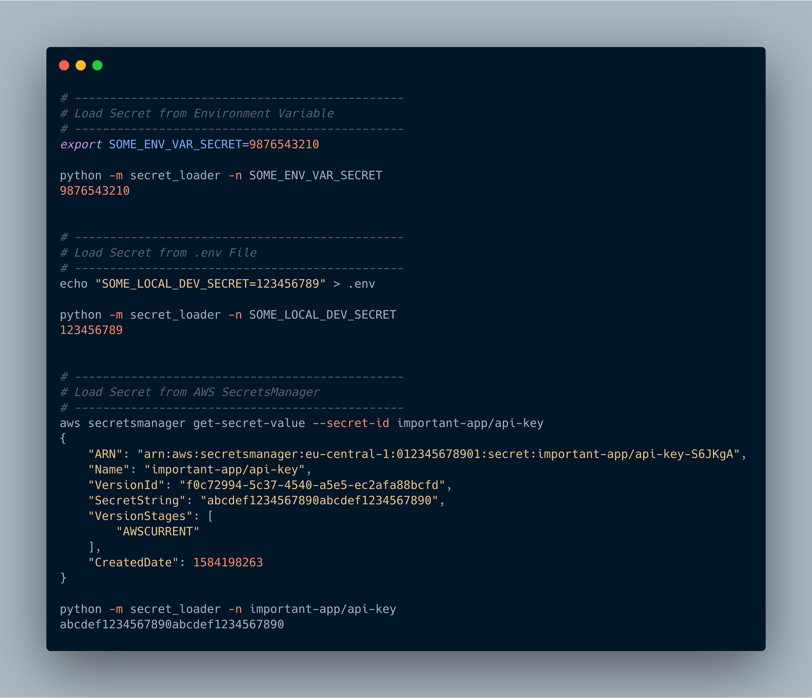

[](https://github.com/JimFawkes/secret-loader/actions)
[](https://codecov.io/gh/JimFawkes/secret-loader)

[](https://github.com/psf/black)
[](COPYING)
[](https://github.com/JimFawkes/secret-loader/releases)

# Secret-Loader
Flexible Secret Loader

 * Unified interface for different secret backends
 * Easy to add new backends
 * Easily configure precendence of loaders/backends
 * Use the same precedence in bash scripts and your application

#### Why?
The intent is to have a single interface to access secrets no matter which
secret backend is used. Personally I faced the following setup in several projects:
 * Production/Staging Systems on AWS with secrets stored in AWS SecretsManager
 * Local/Dev Setup with "secrets" stored in .env file or environment variables


This project aims to work just the same no matter which scenario you are using.
It should first check the environment variables, then the next configured loader
and so on until a valid secret by the given name is found and returned.

Additionally there is a cli because sometimes you want to retrieve secrets before
your application runs (e.g. connecting to a database inside a docker entrypoint
script). This way you get the same behaviour for both your application and other
scripts.

#### Default Precedence/Priority of Loaders
The following locations will be probed for an existing value with the name `secret_name`
in this order:
 1. Environment Variables
 1. A `.env` file
 1. AWS SecretsManager (using boto3 search order to search for valid aws credentials)


## How to install
```bash
python -m pip install secret_loader
```

## How to use the secrets_loader

#### Basic/Out-of-the-box usage
```python
from secrets_loader import secret

api_token = secret("SOME_API_TOKEN")
# Make some use of the token ...
```

#### Add a custom loader
```python
from secret_loader import secret
from secret_loader.exceptions import SecretNotFoundError
from secret_loader.base import BaseLoader

class MyCustomLoader(BaseLoader):
    def load(self, secret_name, **kwargs):
        # Do something to get the secret_value
        secret_value = "some-very-important-secret"

        if not secret_value:
            # This is necessary/expected to indicate that the secret was not found
            raise SecretNotFoundError(f"MyCustomLoader cloud not load {secret_name}")

        return secret_value

secret.register(MyCustomLoader, priority=100)
important_secret = secret("my_secret_name")
```

## How to run the secrets_loader from the Command Line
```
python -m secret_loader --help

usage: secret_loader [-h] [--name NAME] [--fail] [--loader {EnvLoader,EnvFileLoader,AWSSecretsLoader}] [--custom_loader CUSTOM_LOADER] [--priority PRIORITY] [--remove_loaders] [--list_loaders] [--debug]

Secret-Loader

A unified way to laod secrets from different sources.

The secrets-loader will try to load a secret from a list of places:
 1. the current Environment
 2. a local .env file
 3. AWS SecretsManager

The result is printed to standard out, so besure to use this wisely.

optional arguments:
  -h, --help            show this help message and exit
  --name NAME, -n NAME  Name of Secret to Load
  --fail                Fail if Secret is not Found
  --loader {EnvLoader,EnvFileLoader,AWSSecretsLoader}
                        Specify a Loader to use
  --custom_loader CUSTOM_LOADER
                        Use custom Loader, specified as an importable string e.g., 'some.module.CustomLoader'
  --priority PRIORITY, -p PRIORITY
                        Specify a specific priority level for a selected or custom loader
  --remove_loaders      Remove pre-registered Loaders
  --list_loaders, -l    List all currently available loaders
  --debug, -d           Print Debug Messages

Version 0.5 - June 2020 - Moritz Eilfort - src: github.com/JimFawkes/secret-loader
License GPLv3+ - Copyright 2020 Moritz Eilfort
```

## Examples for CLI Usage



## How to run the tests
```bash
pytest
```
